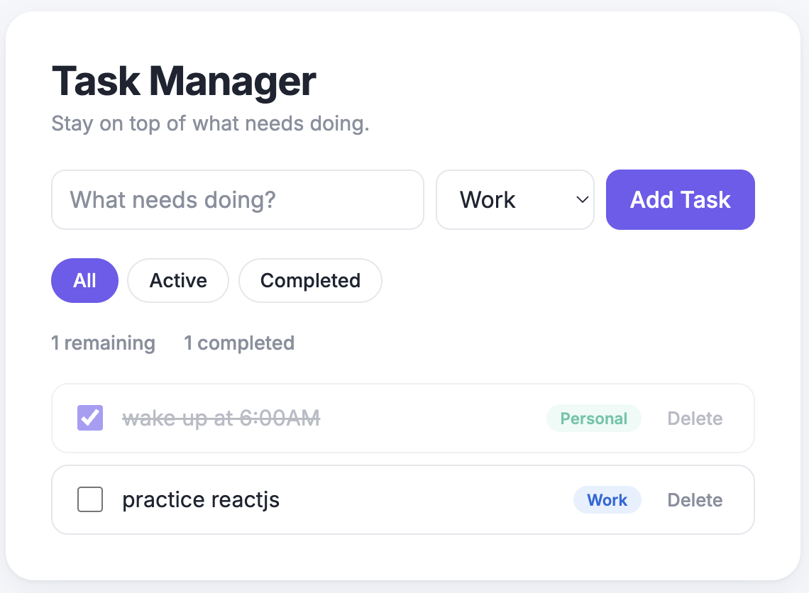
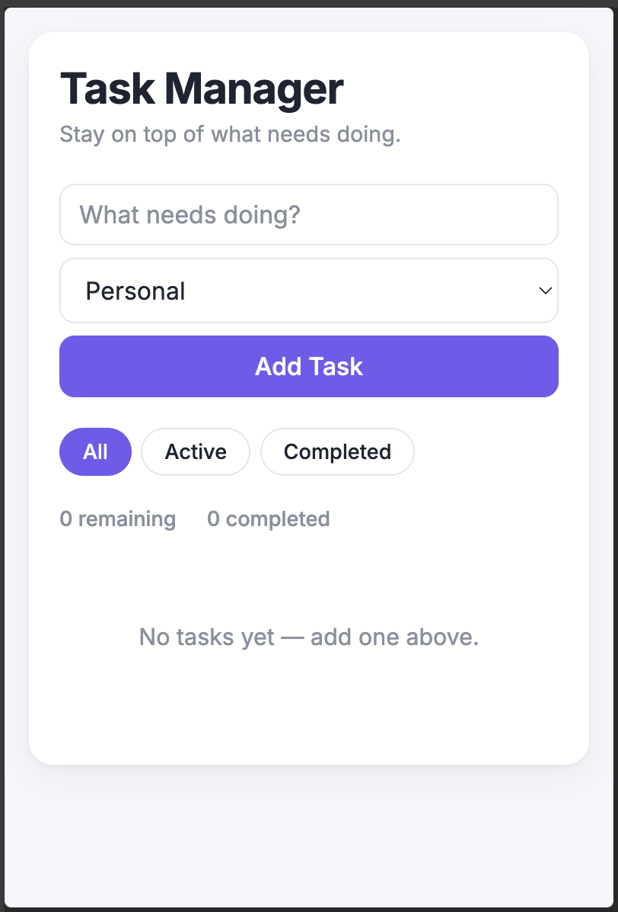
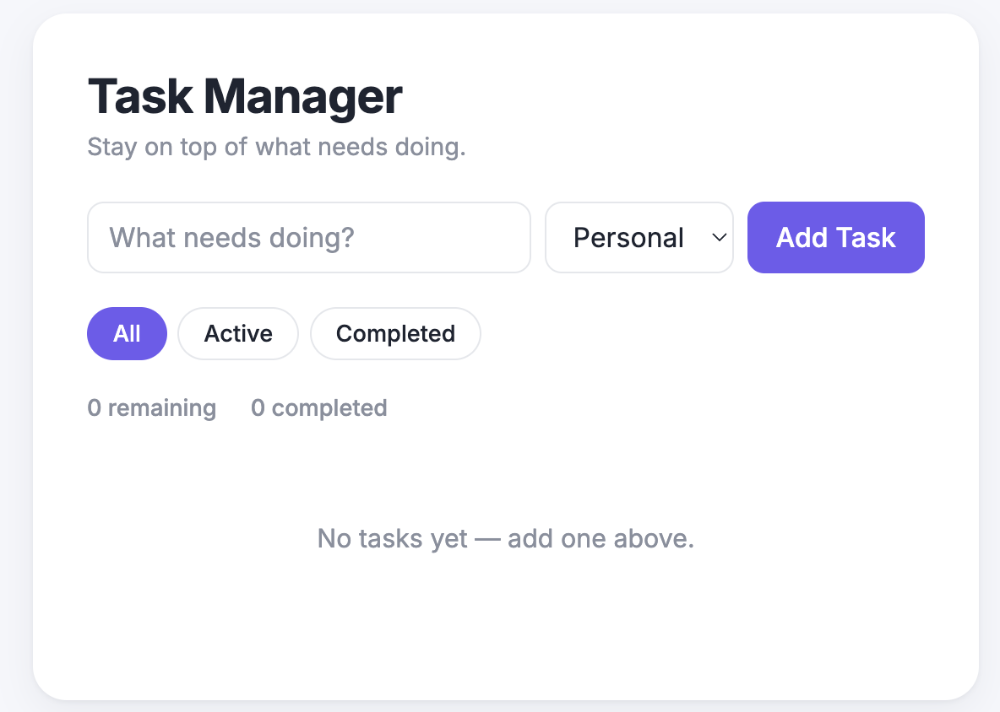

# Task Manager

A responsive task management web app built with React. Add tasks, sort them into categories, filter by status, and track progress with live counts — everything is saved locally in the browser, so your list survives a page refresh.

## GitHub Repository

https://github.com/rabintmalla/task-manager

## Features

**Core functionality**
- Add a new task with a title and category
- Mark tasks complete / incomplete
- Delete tasks
- Filter tasks by status: All / Active / Completed
- Live count of remaining and completed tasks
- Data persists across page refreshes via `localStorage`
- Friendly empty-state message when no tasks exist (or none match the current filter)
- Responsive layout — works on both desktop and mobile screen widths

**UI polish**
- Card-based layout with soft shadows on a light background
- Custom typography using the Inter Google Font
- Purple accent theme applied consistently across buttons, focus states, and the active filter
- Color-coded category badges — Personal (green), Work (blue), Urgent (red)
- Hover and focus states on inputs, buttons, and task rows for better feedback

**Code quality**
- Built entirely with functional components and hooks (no class components)
- State lifted up to `App.jsx` and passed down via props, keeping each component focused on one job
- Every component and non-obvious line of logic is commented, explaining not just *what* the code does but *why*

## Technologies / Libraries Used

| Technology | Purpose |
|---|---|
| React 18 | UI development (functional components, hooks) |
| Vite | Development server and build tool |
| Plain CSS | Styling and responsive layout (no UI framework) |
| Browser `localStorage` API | Client-side data persistence |
| Git / GitHub | Version control and hosting |

## Project Structure

```
task-manager/
├── index.html
├── package.json
├── vite.config.js
├── README.md
└── src/
    ├── main.jsx          
    ├── App.jsx           
    ├── index.css         
    └── components/
        ├── TaskForm.jsx    
        ├── TaskList.jsx    
        ├── TaskItem.jsx    
        ├── FilterBar.jsx   
        └── TaskStats.jsx   
```

## How It Works

`App.jsx` is the single source of truth for the app's data — the `tasks` array and the active `filter` both live there via `useState`. Every child component receives only the data it needs as props, plus callback functions (like `onAddTask`, `onToggle`, `onDelete`) to request changes — no child component modifies state directly. Two `useEffect` hooks keep `tasks` in sync with `localStorage`: one loads saved tasks once when the app starts, the other saves the list back every time it changes.

## Setup Instructions

1. Clone the repository:
   ```
   git clone https://github.com/rabintmalla/task-manager.git
   cd task-manager
   ```
2. Install dependencies:
   ```
   npm install
   ```
3. Start the development server:
   ```
   npm run dev
   ```
4. Open the local URL it prints (usually `http://localhost:5173`) in your browser.

To create a production build:
```
npm run build
```

## Screenshots





## Known Limitations

- No due dates or reminders (outside this project's chosen scope)
- No drag-and-drop task reordering
- Categories are fixed to Personal / Work / Urgent, not user-editable
- No backend — data is local to whichever browser created it, not synced across devices
- No automated tests

## Possible Future Improvements

- Due dates with overdue indicators
- Drag-and-drop task reordering
- Dark/light theme toggle
- A real backend for cross-device sync

---

Built as a course project for the React JS Course Project assignment.